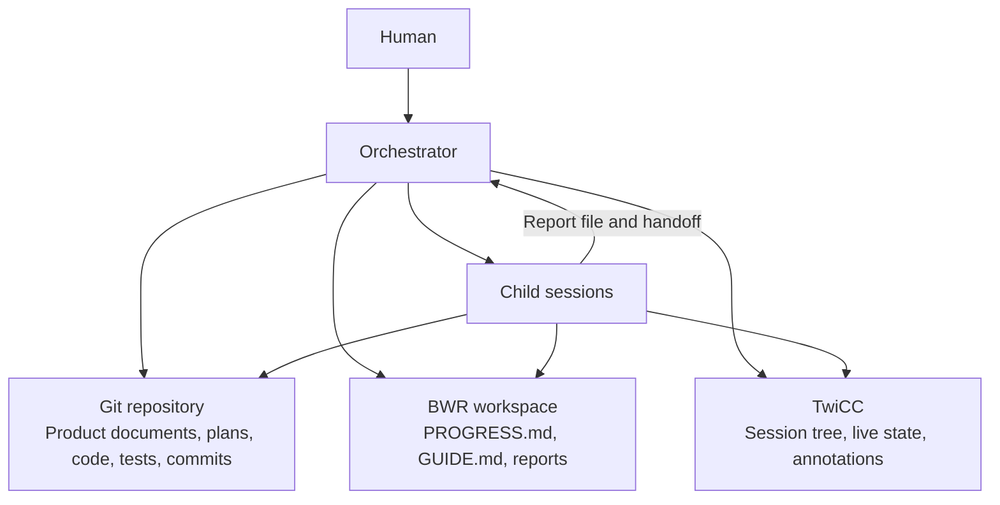

# The Build With Review Operating Philosophy

This document explains how Build With Review operates.

It translates the product philosophy into a simple working model.

It does not define every role prompt. It does not define every report field.

`BWR-DESIGN.md` defines those detailed contracts.

## 1. The operating principle

Build With Review coordinates trusted agents through explicit responsibilities.

The system does not try to prove that every agent performed every action.

It uses four ordinary forms of evidence:

- the current Git state;
- committed plans and product documents;
- Markdown reports;
- direct handoffs between parent and child sessions.

The system trusts an agent that reports completed work.

An independent review can challenge that work later.

This balance gives useful accountability without building a verification engine around the agents.

> **Trust the actors. Preserve their outputs. Review the important results.**

## 2. The operating model

Build With Review uses three separate state layers.



Each layer has one purpose.

### Git repository

Git stores the durable product history.

It contains:

- the current spec;
- Amendments;
- committed lot plans;
- task Designs inside those plans;
- tests and code;
- successful and failed Attempt history.

Git remains basic Git.

BWR creates no private refs. It creates no checksum proof system.

### BWR workspace

The BWR workspace stores the operational memory of one BWR run.

It contains:

- `PROGRESS.md`;
- `GUIDE.md`;
- optional Human-owned `ADDITIONAL-INSTRUCTIONS.md`;
- reviewer reports;
- verifier reports;
- fixer reports;
- Implementer and failure reports;
- other handoff artifacts when a role needs them.

The BWR workspace remains the same across all lots in the run.

Its path is `<ACTIVE_PROJECT_ROOT>/bwr_workspace/<FEATURE>`.

### TwiCC

TwiCC is the only session system.

It stores:

- the session tree;
- live process state;
- session metadata;
- BWR annotations;
- archived and hidden session history.

BWR does not support a second subagent provider.

Every former subagent role becomes a TwiCC child session.

## 3. Sources of authority

When two sources disagree, use this order:

1. System instructions and project instructions.
2. A current Human decision.
3. The Current Spec and its incorporated Amendments.
4. The current committed Lot plan.
5. The current Task Design.
6. The current Git state for technical facts.
7. `GUIDE.md`.
8. `PROGRESS.md`.
9. Reports.
10. Annotations.

The higher source controls product intent.

The real repository resolves technical assumptions.

A report records an observation. It does not silently replace the spec or plan.

## 4. One writer at a time

Only one session writes tracked product files at a given time.

The active writer can be:

- the Orchestrator while writing the spec or plan;
- a Fixer while correcting a product document;
- an Implementer while writing a Design, tests, or code.

Reviewers do not edit the subject they review.

Parallel reviewers write different report files.

This rule prevents write conflicts without locks, inode checks, or file ownership scripts.

## 5. Parent and child responsibilities

A parent manages only its direct children.

The parent:

- chooses the child role;
- assigns one logical assignment;
- creates a unique report path;
- supplies the required inputs;
- creates the session in the correct TwiCC project;
- sets identity annotations;
- receives and accepts the handoff;
- sends follow-up work when required;
- archives and hides the child after final acceptance.

The child:

- reads its common and role prompts;
- works with the Human question widget disabled;
- performs the assigned work;
- writes its assigned report;
- keeps its status current;
- sends a concise handoff to its parent;
- never asks the Human directly.

The parent does not monitor grandchildren.

The child that creates another session becomes that session's parent.

## 6. Session ownership by role

The Orchestrator directly owns:

- Spec reviewers;
- Reach reviewers;
- the Spec fixer;
- the Amendment fixer;
- the Plan completeness checker;
- the Consolidation checker;
- Implementers;
- Construction diagnostics;
- Product reviewers;
- Finding verifiers;
- a successor Orchestrator when one is needed.

An Implementer directly owns:

- Design checkers;
- Code checkers.

Construction diagnostic shares a provider group with Implementer checkers.

It remains a direct child of the Orchestrator.

It compares failed Attempts and must remain outside the failed implementation context.

## 7. One session, one logical assignment

One child session owns one logical assignment.

The same session receives follow-ups for that assignment.

Examples include:

- a Product reviewer revising one report after an `unverifiable` verdict;
- a Finding verifier checking the revised version of the same report;
- a Fixer handling consecutive corrections in one document loop.

A new logical assignment creates a fresh session.

This applies to:

- a new review round;
- a new Product Review pass;
- a new task;
- a new Attempt;
- a new Design check round;
- a new Code check round.

A replacement session uses the same logical assignment only when the original session is unusable.

The parent stops the old writer before creating its replacement.

The replacement inherits the same Report path. Recovery uses a fresh Report path for unfinished work.

## 8. Session creation and retirement

Every non-Orchestrator child session title starts with the exact prefix `- `.

The prefix applies at every level of the session tree.

It never applies to an Orchestrator.

Initial, successor, and Recovery Orchestrators use normal master-session titles.

Every child starts in the exact TwiCC project used by its parent.

This rule preserves the correct checkout or worktree.

The parent must never silently use the default project checkout.

Every non-Orchestrator child is muted at creation.

This includes the watchdog.

An Orchestrator remains unmuted.

Children remain visible while they work.

Every non-Orchestrator child starts with the Human question widget disabled.

Every Orchestrator keeps the Human question widget enabled.

After final acceptance of a non-Orchestrator child, the parent performs this sequence:

1. Set the correct terminal status.
2. Archive the child session.
3. Hide the child session.

Archiving removes completed work from ordinary live views.

Hiding keeps the Human sidebar clean, including archived views.

Historical searches must explicitly include archived and hidden sessions.

BWR never archives or hides an Orchestrator.

## 9. Session status

BWR uses these status values:

- `working`;
- `idle`;
- `blocked`;
- `done`;
- `failed`;
- `superseded`;
- `cancelled`.

`idle` means that the session waits for a possible follow-up.

`blocked` work can resume in the same session. `failed` work cannot.

It does not mean pause.

BWR has no special pause protocol and no special stop protocol.

The Human can tell any agent to stop and continue later.

The parent sets identity annotations when it creates the child.

The child maintains its own status during work.

The parent can correct a stale status after it observes the real state.

## 10. Annotations

Annotations make the TwiCC topology readable.

They never prove that a transition occurred.

The available BWR annotation keys are:

- `bwr.role`;
- `bwr.status`;
- `bwr.phase`;
- `bwr.feature`;
- `bwr.lot`;
- `bwr.task`;
- `bwr.attempt`;
- `bwr.round`;
- `bwr.pass`;
- `bwr.mandate`;
- `bwr.correction`.

Every BWR session receives only the keys that apply to its assignment.

The common keys are:

- `bwr.role`;
- `bwr.status`;
- `bwr.feature`.

The other keys are conditional.

Do not write empty values such as `null`, `none`, or `0` for inapplicable keys.

The watchdog does not need `bwr.phase`.

Lot identifiers always use a string with the `lot-` prefix.

Examples include:

- `lot-1`;
- `lot-1.1`;
- `lot-1.10`.

This format prevents tools from changing `1.10` into `1.1`.

Use this format everywhere, not only in annotations.

## 11. Handoffs

A child returns its detailed work through its assigned report file.

It sends only a concise handoff message to its parent.

The common handoff format is:

```text
RESULT: READY | BLOCKED | FAILED
REPORT: <assigned absolute path>
SUMMARY: <one short result>
PARENT ACTION: <next expected action, or none>
```

The child sends this handoff through a direct TwiCC message.

The parent accepts a handoff when:

- the child announces one valid result;
- the child returns the exact assigned report path;
- the report exists at that path.

The active Workflow explicitly tells the parent to read or not read the report.

A routing parent does not read it. It passes the exact path to the next child.

The parent reads it when it must act on details, make a detailed decision, inform the Human, or analyze an exceptional result.

When it reads, it checks visible completeness only.

It does not repeat the assignment, verify claims, reconstruct hidden work history, or use a validation script.

`READY` is the child's claim that its current deliverable is ready for the parent.

The parent accepts that deliverable for routing.

The child remains `idle` when its logical assignment can still receive a follow-up.

The parent sets `done` only when final acceptance closes the logical assignment.

Status around a handoff follows this model:

- creation or follow-up: `working`;
- `READY`: `idle` until acceptance;
- `BLOCKED`: `blocked`;
- `FAILED`: `failed`;
- final acceptance: `done`, then archive and hide.

## 12. Reports

Reports are durable working memory for the BWR run.

They prevent one session from reading another session transcript.

The parent assigns every report path before it creates the child.

The path comes from the logical assignment.

It does not use a session identifier, checksum, inode, or generation identifier.

Examples include:

```text
<BWR_WORKSPACE>/reports/spec/round-1/reviewer-enumerator.md
<BWR_WORKSPACE>/reports/spec/round-2/reviewer-scoped.md
<BWR_WORKSPACE>/reports/spec/fixer.md
<BWR_WORKSPACE>/reports/construction/lot-2/plan-check-round-1.md
<BWR_WORKSPACE>/reports/construction/lot-2/task-3/attempt-1/implementer.md
<BWR_WORKSPACE>/reports/construction/lot-2/task-3/attempt-1/design-check-round-1.md
<BWR_WORKSPACE>/reports/construction/lot-2/task-3/attempt-1/code-check-round-1.md
<BWR_WORKSPACE>/reports/product-review/lot-2/pass-1/reviewer-meaning.md
<BWR_WORKSPACE>/reports/product-review/lot-2/pass-1/verifier-meaning.md
```

A new logical round, pass, task, or Attempt receives a new path.

A follow-up for the same assignment overwrites the same report.

BWR does not create `v2`, `v3`, or checksum-based variants for that follow-up.

Reports remain available for the complete BWR run.

BWR does not commit them to the product repository.

BWR performs no automatic report compaction.

## 13. PROGRESS.md and GUIDE.md

Only the Orchestrator writes `PROGRESS.md`.

This single-writer rule prevents concurrent edits.

`PROGRESS.md` records meaningful operating changes.

It does not copy every child message or every report detail.

Its structure is:

```markdown
# BWR Progress

## Run

## Provider Choices

## Review Concurrency

## Lots

## Human Decisions

## Amendments

## Durable Log

## Blockers

## Final Result
```

`PROGRESS.md` does not duplicate the active session tree.

TwiCC topology provides that information more reliably.

It does not duplicate every session status.

Annotations and TwiCC process state provide that information.

It contains enough information for the Orchestrator to continue after context loss.

It also gives a successor Orchestrator the operating choices for the next lot.

Only the Orchestrator writes `GUIDE.md`.

`GUIDE.md` contains the Git convention and complete Gate execution plan.

Every Orchestrator and Implementer reads it.

## 14. Git history

Git records important product states.

The workflow commits:

- a validated spec;
- an incorporated Amendment;
- a validated lot plan;
- each completed task;
- each completed failed Attempt;
- the plan that routes the next Attempt;
- committed correction obligations.

BWR never rewrites a failed Attempt out of history.

It uses this sequence:

1. Commit the complete failed Attempt state.
2. Write the failure report in the BWR workspace.
3. Start the next commit with `git revert --no-commit` for the failed Attempt.
4. Update the tracked plan with the new Design or route.
5. Commit the revert and updated plan together.

This sequence preserves both the failure and the response.

BWR does not reset to an old commit.

It does not maintain special BWR refs.

It does not move plans between Git and the BWR workspace.

The authoritative plan remains tracked in the repository.

## 15. The current checkout

BWR works in the checkout that the Human selected.

It does not create an automatic worktree.

It does not create a detached checkout or temporary branch.

Every child uses the same TwiCC project as its parent.

BWR never resets unrelated Human changes.

If existing changes overlap the requested work, the responsible agent must preserve them or ask for direction.

## 16. Frozen review subjects

Every independent review examines a stable subject.

The Design remains unchanged while a Design checker reads it.

The code diff remains unchanged while a Code checker reads it.

Every Product reviewer in one pass examines the same exact commit.

If the subject changes, the parent marks the running review `superseded`.

The parent then archives and hides that review session.

A fresh session reviews the new subject.

The stable Git state or unchanged file is sufficient evidence.

BWR needs no checksum protocol around it.

## 17. Spec Review

Spec Review uses independent mandates.

The mandate set includes:

- Enumerator;
- Verifier;
- Feasibility;
- Judge;
- Ripple;
- Scoped.

`BWR-DESIGN.md` defines the exact mandate contracts.

The role prompts implement them.

Each reviewer writes one separate report.

The Orchestrator gives all report paths to one Spec fixer.

The same Spec fixer remains available through the correction loop.

It can wait in `idle` while reviewers work.

The Spec fixer:

- edits the spec;
- addresses every finding;
- records each disposition in its report.

Review sessions are fresh for each logical review round.

The loop after a complete round finds problems is:

```text
Full Review
-> Spec fixer
-> Scoped Review
-> Spec fixer when required
-> Scoped Review until clean
-> Fresh Full Review
```

Ripple joins complete rounds after the first round.

Only a clean complete round validates the spec.

A clean complete round skips the Fixer and Scoped Review.

Spec findings do not use Finding verifiers.

The next review round validates the fixer's work.

When the Human requests a Spec change, the same Spec fixer applies it and records the exact result.

That correction receives Scoped Review before the next complete round.

The Human approves the resulting product contract.

## 18. Amendment

An Amendment starts from a verified Human product decision.

The Orchestrator writes the initial Amendment.

One Reach reviewer per round then inspects its indirect effects.

That reviewer writes one report for the round.

The same Amendment fixer:

- updates the Amendment;
- applies and records each Human decision returned during correction;
- produces the Updated Spec after Reach Review becomes clean;
- records each disposition.

A clean Reach Review is required.

A fresh Consolidation checker then compares:

- the old spec;
- the accepted Amendment;
- the new spec.

The new spec must equal the old spec plus the accepted Amendment.

A discrepancy returns to the same Amendment fixer.

A fresh Consolidation checker examines the corrected result.

Amendment review does not use Finding verifiers.

The next Reach Review or Consolidation check validates each correction.

## 19. Lot planning

The Orchestrator writes the lot plan.

It repeatedly self-reviews the plan before independent review.

The plan stays thin.

It defines responsibilities, tasks, order, dependencies, required outcomes, and verification obligations.

Each task contains a tracked Design section.

The Implementer later writes the Design into that section.

The Plan completeness checker receives:

- the current spec;
- the current lot plan;
- parent plans when the lot is a sub-lot.

If the checker finds a problem, the Orchestrator:

1. corrects the plan;
2. self-reviews it again;
3. creates a fresh Plan completeness checker.

A clean check permits the Orchestrator to commit the plan.

## 20. Task construction

One Implementer owns one task Attempt.

The task follows this order:

```text
Inspect repository
-> Write Design in tracked plan
-> Self-review Design
-> Correct Design
-> Repeat self-review until internally clean
-> Fresh Design checker
-> Correct findings
-> Repeat self-review and fresh checking until clean
-> Write tests and code
-> Self-review complete change
-> Correct change
-> Repeat self-review until internally clean
-> Fresh Code checker
-> Correct findings
-> Repeat self-review and fresh checking until clean
-> Full Gate
-> Commit
-> Handoff
```

The Implementer can run targeted checks at any time.

It can also run the complete Gate during implementation.

The mandatory complete Gate occurs after the final clean Code check.

The Design checker and Code checker never edit the candidate.

The Implementer owns all corrections inside the Attempt.

After any correction, the Implementer performs another self-review before a fresh checker starts.

The successful task commit contains the final Design, tests, and code together.

## 21. Failed Attempts

A Gate failure does not automatically end an Attempt.

The Implementer first analyzes and corrects the failure in the same session.

Any content correction returns through self-review and a fresh Code checker.

The Implementer uses `FAILED` only when it cannot produce a valid complete Gate.

It uses `BLOCKED` only when resolution needs external information or action.

Every failed Attempt report includes:

- the failure stage;
- the observed behavior;
- the checks performed;
- the probable cause;
- the recommended restart point.

Repeated comparable failures can trigger one Construction diagnostic.

The diagnostic reads the failure report paths.

It does not need the old session transcripts.

It compares the failed Attempts and recommends the next route.

A fresh Attempt receives the relevant failed Attempt reports and any Diagnostic report.

The new Implementer uses them as evidence and follows the current Spec, Plan, Task, and project state as authority.

An earlier-Task or Plan restart passes the same evidence through Planning.

Planning commits the revised Plan with the pending failed-Attempt revert. Construction resumes at the earliest affected Task.

## 22. Product Review

Product Review uses five fixed lenses:

- `unlooked`;
- `user`;
- `meaning`;
- `quality`;
- `coverage`.

All five reviewers examine the same commit.

They can run in parallel within the Human-selected review concurrency limit.

Each reviewer writes one report.

The Orchestrator can start verification as reports arrive.

It does not allow code changes until every report and verification is settled.

The Product reviewer remains available in `idle` while its findings are verified.

A clean report can close without a verifier.

A report with findings receives one Finding verifier.

That verifier checks every finding in the report.

## 23. Finding verification

A Finding verifier returns one verdict for each finding:

- `confirmed`;
- `disproved`;
- `unverifiable`.

`unverifiable` means that the report lacks enough precise evidence for a verdict.

The Orchestrator returns that report to the same Product reviewer.

The reviewer overwrites its existing report.

The same Finding verifier then checks the revised report.

The verifier overwrites its existing verification report.

The reviewer and verifier remain available until all findings are settled.

The Orchestrator identifies a finding by its report path and local identifier.

For example:

```text
<BWR_WORKSPACE>/reports/product-review/lot-2/pass-1/reviewer-meaning.md#F2
```

Each report uses local identifiers such as `F1`, `F2`, and `F3`.

The Orchestrator can merge duplicate confirmed findings.

It preserves all source identifiers in the merged correction obligation.

It creates no extra consolidation actor for duplicate findings.

## 24. Product Review outcomes

A Product Review pass closes only after every lens is settled.

If no confirmed finding remains, the lot is clean.

If confirmed findings remain, the Orchestrator writes correction obligations into a committed plan.

Each obligation includes its source finding identifiers.

The plan routes the work through:

- a Correction Round for bounded local work;
- a sub-lot for structural work.

The Implementer reads the committed correction plan.

It does not need the Product reviewer session transcript.

After any correction, all five Product Review lenses run again on the new commit.

No lens can reuse a verdict from an older commit.

## 25. Product decisions

A Product Review finding that appears to require a product decision first goes to its Finding verifier.

The verifier checks:

- whether the spec already answers the question;
- whether evidence disproves the question;
- whether a real product choice remains.

Only a verified product choice reaches the Human.

Outside Product Review, the Orchestrator performs the same examination before asking the Human.

The Orchestrator gives the Human a self-contained explanation.

It includes:

- where the issue was discovered;
- which role discovered it;
- the current workflow phase;
- the product problem;
- the verified evidence;
- why the spec does not answer it;
- why the decision is needed now.

For each option, it explains:

- the resulting behavior;
- the user consequence;
- the advantages;
- the disadvantages;
- the risks;
- the next workflow route.

The Orchestrator can recommend one option and explain the recommendation.

A short question widget never replaces this context.

The Human must not need to read reports, session history, or `PROGRESS.md` before answering.

During Spec work, the Spec fixer integrates the decision.

After Construction starts, the Orchestrator creates an Amendment.

The Orchestrator records the decision and its consequence in `PROGRESS.md`.

## 26. Blockers

A child never asks the Human directly.

It sends the parent:

- the missing information;
- why it is required;
- what it already checked;
- the action that can unblock the work.

The parent answers when it has authority and evidence.

Otherwise, the issue moves up to the Orchestrator.

The Orchestrator presents a complete question to the Human.

The system does not repeat the same acknowledged blocker.

The watchdog can remind the Orchestrator that the blocker remains open.

## 27. Review and correction loops

BWR does not use arbitrary retry limits.

A loop continues while it produces new, verifiable corrections.

The Orchestrator asks the Human when:

- the same issue repeats without new evidence;
- independent conclusions remain incompatible;
- another iteration cannot add useful evidence;
- progress requires a product decision;
- progress requires external action.

The system does not treat difficulty or elapsed time alone as failure.

## 28. Provider choices

The first Orchestrator asks all routine provider questions at the start of the run.

It does not wait until each role is first needed.

This allows the Human to leave the screen after setup.

There is one question for each provider group:

1. Document reviewers:
   - Spec reviewers;
   - Reach reviewers;
   - Plan completeness checker;
   - Consolidation checker.
2. Fixers:
   - Spec fixer;
   - Amendment fixer.
3. Implementer.
4. Implementer checkers:
   - Design checker;
   - Code checker;
   - Construction diagnostic.
5. Product reviewers.
6. Finding verifiers.

The Orchestrator uses as many consecutive question widgets as the current provider needs.

The design specifies no fixed widget count.

The Orchestrator records all choices in `PROGRESS.md`.

The Human can change any provider choice during the run.

The Orchestrator then updates `PROGRESS.md`.

The initial setup does not ask for the current Orchestrator's provider.

When the current Orchestrator creates a successor, it asks which provider to use.

The successor receives the previous provider map as its defaults.

It does not repeat routine provider questions.

## 29. Presets

The Human chooses providers.

The role determines the preset.

The standard preset mapping is:

| Role | Preset |
|---|---|
| Orchestrator | `Controller` |
| Watchdog | `Minimal` |
| Spec Enumerator and Ripple | `ReviewerLight` |
| Other Spec reviewers | `Reviewer` |
| Reach reviewers | `Reviewer` |
| Plan completeness checker | `ReviewerMedium` |
| Consolidation checker | `ReviewerMedium` |
| Spec fixer and Amendment fixer | `Fixer` |
| Implementer | `Implementer` |
| Design checker and Code checker | `Reviewer` |
| Construction diagnostic | `Reviewer` |
| Finding verifier | `ReviewerLight` |
| Product reviewer: `unlooked` | `Reviewer` |
| Product reviewer: `user` | `Reviewer` |
| Product reviewer: `meaning` | `ReviewerMedium` |
| Product reviewer: `quality` | `Reviewer` |
| Product reviewer: `coverage` | `ReviewerMedium` |

These mappings preserve the former model and effort levels:

- strong model and high effort becomes `Reviewer`;
- strong model and medium effort becomes `ReviewerMedium`;
- lighter model and medium effort becomes `ReviewerLight`.

The watchdog uses its fixed provider and `Minimal` preset.

The Human can still give a live instruction that overrides a normal choice.

## 30. Review concurrency

The Human selects one review concurrency limit at run start.

The Orchestrator records it in `PROGRESS.md`.

A successor Orchestrator inherits it.

The limit applies to parallel review batches.

It does not create parallel Implementers.

The Orchestrator enforces the limit directly.

BWR needs no concurrency script.

## 31. Prompt composition

Role prompts live in the installed BWR skill.

BWR does not copy them into the BWR workspace.

Every session type created by BWR has one entry prompt file.

The entry file contains its role instructions.

It includes its applicable common prompts with TwiCC `@@` markers.

The creator starts the session prompt with one absolute `@@` marker for this entry file.

TwiCC expands the complete fixed prompt before the child receives it.

The parent does not load the fixed prompt files into its context.

Included prompt files use `@@./path` or `@@../path` for relative includes.

Each relative marker resolves against the file that contains it.

Nested files therefore resolve their own relative markers from their own directories.

Fixed common content comes first.

Fixed role content comes next.

An immediate fixed Startup Workflow follows when the entry has one startup route.

Optional Human additional instructions follow the fixed content.

Dynamic assignments and paths come last.

This order allows provider prompt caching.

The prompts use these placeholders:

- `<BWR_SKILL>`;
- `<BWR_WORKSPACE>`.

The dynamic suffix gives the real values.

The common prompt files are:

- `<BWR_SKILL>/prompts/common/child.md`;
- `<BWR_SKILL>/prompts/common/parent.md`.

Every child entry file includes `child.md`.

Every entry file for a session that can create children also includes `parent.md`.

Each entry file then contains its fixed role instructions.

The parent places the optional Human file marker after the fixed entry marker:

```text
@@/absolute/bwr-workspace/ADDITIONAL-INSTRUCTIONS.md
```

This path is illustrative. The parent builds the marker with the real absolute BWR workspace path.

TwiCC removes the marker line when the file does not exist.

The dynamic assignment follows this optional include.

BWR has only this one additional instruction file.

It does not recreate a per-role additional prompt system.

An Initial or Recovery Orchestrator starts directly through `SKILL.md`. The skill routes it to the applicable Startup Workflow.

A current Orchestrator creates its successor with the Orchestrator entry prompt.

That entry composes the common Workflow, parent, Orchestrator Role, and Successor Startup Workflow.

The Implementer entry prompt composes the child prompt, parent prompt, and Implementer prompt.

Product reviewer entries compose the child prompt, reviewer prompt, product reviewer prompt, and their lens Role prompt.

Other ordinary reviewer and checker entries compose the child prompt, reviewer prompt, and their role prompt.

Spec fixer and Amendment fixer entries compose the child prompt, fixer prompt, and their role prompt.

Other actor entry prompts compose the child prompt and their role prompt.

The Watchdog entry contains only its self-contained Watchdog prompt.

## 32. The BWR workspace lifecycle

One BWR run uses one BWR workspace.

Its path is `<ACTIVE_PROJECT_ROOT>/bwr_workspace/<FEATURE>`.

All lots in that run share it.

The BWR workspace contains operational evidence only.

It does not contain a copied BWR skill.

A Recovery Orchestrator uses a Human-supplied BWR workspace path when available.

Otherwise, it discovers candidates below the active project's `bwr_workspace/` directory and asks the Human to confirm one.

It reads the selected BWR workspace's Human-owned additional instructions when they exist.

At feature completion, the Orchestrator asks the Human whether to keep or delete it.

The recommended answer is to keep it.

BWR never deletes the BWR workspace automatically.

## 33. Orchestrator succession

Changing the Orchestrator is optional.

It can occur between lots.

It does not occur inside a lot as a normal workflow step.

A successor Orchestrator starts fresh for the new lot.

It does not need the old session topology.

It receives:

- the new lot;
- the BWR workspace path;
- the current repository state;
- the current spec;
- the previous operating choices as recommended defaults.

The old watchdog stops before succession.

The successor starts its own watchdog.

## 34. Watchdog

The watchdog is the only BWR runtime script.

It is a standalone heartbeat helper.

Its provider is always `claude_code`. Its preset is always `Minimal`.

It does not decide workflow transitions.

It reports the state of the Orchestrator's direct children at regular intervals.

It helps the Orchestrator notice:

- a child that remains quiet for too long;
- a child with no live process;
- a stale annotation status;
- completed work that still needs acceptance;
- an Orchestrator that stopped progressing.

The watchdog includes hidden sessions.

It excludes archived sessions.

It also excludes terminal statuses:

- `done`;
- `failed`;
- `cancelled`;
- `superseded`.

It preserves the proven behavior of the old watchdog.

The rewrite removes only the former provider-subagent support.

The watchdog observes, informs, and reminds.

It never repairs state automatically.

## 35. Gate definition

The Gate is not an actor and not a BWR verification engine.

It is the Human-approved set of project validation commands.

The first Orchestrator searches for all credible validation commands in:

- project documentation;
- CI configuration;
- package manager scripts;
- repository configuration;
- existing project tooling.

It presents the discovered commands to the Human.

The Human decides which commands belong to the Gate.

The Orchestrator records every discovered command in `GUIDE.md`.

It records both included and excluded commands.

An exclusion includes its reason.

A later Orchestrator reuses the existing Gate without asking again.

A preexisting command discovered later becomes a new Human choice.

## 36. Gate changes

A validation command created by an Implementer automatically joins the Gate.

The Implementer reports the new command in its handoff report.

The Orchestrator adds it to `GUIDE.md`.

A simple command rename replaces the old command automatically.

Removing a Gate command without replacement requires a Human decision.

Reducing validation coverage also requires a Human decision.

BWR keeps no separate Gate version history.

Git records changes to the project commands.

## 37. Gate execution

During implementation, the Implementer chooses the useful validation scope.

It can run:

- one targeted test;
- one targeted lint check;
- part of the Gate;
- the complete Gate;
- another relevant project check.

Generic BWR prompts name no language-specific validation tool.

Every successful task ends with the complete Gate.

The complete Gate runs after the final clean Code check.

If the Gate fails, the Implementer can correct the problem in the same Attempt.

Any content correction returns through self-review and a fresh Code checker.

The final Implementer report includes:

```markdown
## Final Gate

- Executed: yes
- Result: passed
```

An Implementer cannot send `READY` without this declaration.

The parent trusts the declaration.

The final task Gate validates all accumulated work.

No duplicate Gate is required before Product Review when tracked files remain unchanged.

## 38. Human interaction

The Human can work on something else while BWR runs.

Every Human question must therefore contain all required context.

The Orchestrator does not send a raw question without explanation.

It explains the problem, evidence, consequences, and available routes.

Routine Human interaction is limited to:

- initial provider choices;
- the review concurrency limit;
- the initial Gate definition;
- Spec approval;
- verified product decisions;
- evidence stalemates;
- external blockers;
- successor Orchestrator provider choice;
- final BWR workspace retention.

The Human can change any live instruction at any time.

The Orchestrator records durable run consequences in `PROGRESS.md`.

## 39. Delivery

BWR announces delivery only when:

- all planned lots are complete;
- the last complete Gate passes;
- the last complete Product Review is clean;
- no confirmed finding remains open;
- no product decision remains open;
- no blocker remains open.

Historical reports can contain corrected or disproved findings.

Those findings do not block delivery.

The final evidence is:

- the current Git state;
- the final Gate declaration;
- the clean final Product Review.

No additional checksum is required.

## 40. Closing a run

After delivery, the Orchestrator:

1. records the final result in `PROGRESS.md`;
2. stops the watchdog;
3. archives and hides remaining non-Orchestrator child sessions;
4. presents the delivered commits and Gate result to the Human;
5. asks whether to keep or delete the BWR workspace.

BWR does not merge automatically.

It does not delete branches.

It does not modify or remove a worktree.

## 41. Deliberate omissions

BWR deliberately has no:

- `progress.py` command system;
- structured event ledger;
- checksum or inode proof chain;
- automatic history validator;
- private Git refs;
- automatic worktree management;
- report compaction system;
- special pause or stop protocol;
- Gate runner session;
- provider-subagent system;
- runtime script other than the watchdog.

These omissions are part of the design.

They keep the workflow understandable and repairable by ordinary agents.

## 42. The detailed design layer

This document defines responsibilities, authority, state, and transitions.

`BWR-DESIGN.md` defines the detailed contracts used by the skill.

It includes:

- the exact mandate of each reviewer;
- the common finding structure;
- severity categories;
- likelihood or frequency categories;
- the meaning of every category;
- required report sections;
- role-specific acceptance criteria;
- prompt architecture.

Those details become role prompts and report contracts.

They do not require a new validation script.

## 43. Final operating principle

The system stays reliable through clear ownership and independent review.

It does not become reliable by distrusting every agent action.

> **Use Git for durable product history, Markdown for handoffs, TwiCC for sessions, and reviews for confidence.**
