# The Build With Review Philosophy

The core idea fits in one sentence:

> **Turn an intention into a product through repeated cycles of design, construction, proof, and correction.**

Each stage produces something that the next stage can challenge.

```mermaid
flowchart LR
    A[Idea] --> B[Spec]
    B --> C[Spec Review]
    C -->|Findings| D[Fixer]
    D --> C
    C -->|Validated spec| E[Lot Plan]

    E --> F[Task-by-task Construction]
    F --> G[Product Review]

    G -->|No findings| H[Delivered lot]
    G -->|Bounded correction| I[Correction Round]
    G -->|Structural correction| J[Sub-lot]

    I --> F
    J --> E

    K[DECISION] --> L[Human decision]
    L --> M[Spec or Amendment]
    M --> E
    M --> F
    M --> G
```



## 1. The spec defines the product

The first stage turns an idea into a **product contract**.

The spec defines:

- what the product must do;
- what the user sees;
- the important states and cases;
- the global constraints;
- the scope boundaries;
- the means used to verify behavior;
- the division into coherent lots.

The spec does not define functions, signatures, or commands yet.

It stays at the product level.

## 2. The spec does not validate itself

Several reviewers read the complete spec.

Each reviewer has one **precise mandate**. Examples include:

- finding missing cases;
- comparing claims with the existing product;
- checking feasibility;
- detecting ambiguity;
- checking the lot breakdown;
- finding indirect consequences.

The reviewers produce findings. They do not edit the spec.

A **fixer** processes all findings together. The fixer applies them or rejects them with evidence.

A new review then checks the corrected spec.

The loop continues until one complete review produces no findings.

The human then approves the product contract.

## 3. Product decisions remain human decisions

One rule applies everywhere:

> **An agent that must choose behavior not defined by the spec must stop.**

The orchestrator first examines the question.

This examination has three possible results:

- the spec already gives the answer;
- the facts disprove the question;
- the answer requires a product decision.

Only the human decides in the third case.

Each option describes its consequence for the user. It does not focus only on implementation cost.

The answer enters the spec before any new implementation starts.

## 4. Construction makes the product concrete in stages

Construction handles one lot at a time.

The orchestrator first writes a deliberately **thin plan**.

The plan contains:

- the responsibilities of the lot;
- their probable locations;
- the tasks;
- their order;
- their dependencies;
- what each task must achieve;
- the behaviors each task must verify.

A completeness check then reviews the plan.

It mainly looks for:

- a requirement without a task;
- a task without a requirement;
- an impossible dependency;
- a conflict with the spec;
- a task that breaks an already delivered obligation.

If the decomposition is wrong, the workflow returns to the plan.

It does not hide the problem with local patches.

## 5. A task follows a complete loop

Each task is a coherent unit.

It must leave the product in a usable and verifiable state.

Its implementer follows this loop:

1. Inspect the real code.
2. Write the task **Design**.
3. Review that Design.
4. Send the Design to an independent **Design checker**.
5. Correct the Design when necessary.
6. Declare the behaviors that need tests.
7. Write the tests and the code.
8. Run useful checks during implementation.
9. Run the required gate on the complete candidate.
10. Review the complete diff.
11. Send the code and tests to an independent **code checker**.
12. Correct the confirmed findings.
13. Run the required checks again.
14. Produce one coherent commit for the task.

TDD is recommended. It is not the central philosophy.

The central principle is broader:

> **Every declared behavior must have suitable evidence.**

## 6. Design and code have different reviews

The **Design review** happens before implementation.

It checks:

- coverage of the contract;
- consistency between the steps;
- proposed interfaces;
- considered alternatives;
- planned behaviors;
- compatibility with the existing code.

The **code review** happens after implementation.

It checks:

- compliance with the Design;
- code quality;
- errors and edge cases;
- the value of the tests;
- changes outside the task scope;
- consequences in the rest of the product.

This separation prevents a common problem.

Working code can implement a bad Design. A good Design can receive a bad implementation.

## 7. Tests do not prove everything

The gate answers this question:

> **Did anything already verified break?**

It does not automatically answer these questions:

- Is the requested behavior correct?
- Do the tests actually prove that behavior?
- Is an important case missing?
- Does the spec contain an error?
- Does the user experience remain coherent?

The workflow therefore keeps independent reviews.

Tests and reviews serve different purposes.

## 8. Product Review judges the built product

Product Review starts only after the product runs and passes its required checks.

It does not judge the quality of the plan.

It judges what the product actually does.

Several reviewers use different **lenses**. Examples include:

- areas that nobody appears to have examined;
- the user experience;
- functional meaning and consistency;
- internal quality;
- coverage of product obligations.

Each reviewer examines the product from a global perspective.

The lot defines the delivery scope. The complete product defines the observation scope.

This distinction exposes regressions outside the lot.

## 9. A finding does not become work immediately

A reviewer can be wrong.

Each finding must therefore be:

- precise;
- located;
- verifiable;
- tested against the real product.

Another actor confirms or disproves the finding.

The finding author never has the final word.

The orchestrator can then:

- remove a disproved finding;
- return an unclear finding;
- merge duplicates;
- keep a confirmed finding;
- turn a product ambiguity into a DECISION.

The orchestrator does not decide whether a confirmed finding is worth fixing.

The orchestrator performs adjudication. Adjudication does not replace review.

## 10. Corrections return to Construction

Product Review never produces code.

It produces one confirmed set of corrections.

That complete set follows one route.

### Correction Round

A **Correction Round** handles a local and bounded correction.

It preserves:

- the product contract;
- the general structure;
- the responsibilities;
- the existing decomposition.

It contains its own correction tasks.

After construction, a new Product Review examines the complete product again.

### Sub-lot

A **sub-lot** handles a structural problem.

It becomes necessary when the correction changes:

- responsibilities;
- important interfaces;
- decomposition;
- ownership;
- a significant part of the architecture;
- several areas with unbounded coordination.

The sub-lot has its own plan.

It then passes through normal Construction and Product Review.

## 11. A clean review ends the loop

A lot is not delivered after its first construction.

It is delivered after a **complete Product Review with no confirmed finding**.

The actual loop is:

```text
Construction
-> Product Review
-> Corrections
-> New Construction
-> New Product Review
-> No corrections
-> Delivery
```

A correction never closes its own problem.

The next review confirms that the correction works and did not break anything else.

## 12. An Amendment protects the product contract

A DECISION can change an area that has already been built.

In that case, changing only the code is not sufficient.

The workflow first writes an **Amendment**.

An Amendment is a small spec that contains:

- the new decision;
- its reason;
- what it replaces;
- what it must preserve;
- the context that exposed the issue.

A **reach sweep** then finds indirect consequences.

It examines textual and functional dependencies.

For example, removing one screen can make these elements unnecessary:

- an email;
- a link;
- a code;
- a test;
- behavior owned by another lot.

The fixer updates the Amendment and the living spec.

An independent checker verifies the consolidation.

Code work resumes only after the product contract changes.

## 13. A contract change can invalidate current work

After an Amendment, the workflow asks one simple question:

> **Does the interrupted work still have the same objective?**

If it does, the work can continue.

If it does not, its Design is no longer reliable.

The workflow then abandons that attempt and restarts from the new contract.

If the Amendment changes the structure, it can also require a new decomposition.

This principle is important:

> **Do not reuse product reasoning created under a contract that is now false.**

## 14. The workflow moves differently before and after delivery

Before the lot exists as a complete product, the workflow goes back.

It corrects:

- the spec;
- the plan;
- the Design;
- the current task;
- the decomposition.

After the lot is delivered, the workflow moves forward.

It creates:

- a Correction Round;
- or a sub-lot.

It does not rewrite the history of the delivered lot.

The code still remains one living product.

## 15. Roles must remain separate

Role separation is central to the philosophy.

| Role | Responsibility |
|---|---|
| **Human** | Decides product behavior |
| **Orchestrator** | Organizes, plans, adjudicates, and routes work |
| **Reviewer** | Finds problems |
| **Fixer** | Corrects a document after review |
| **Implementer** | Writes the Design, tests, and code |
| **Checker** | Checks a Design or implementation |
| **Verifier** | Confirms or disproves a finding |

One actor can technically perform several roles.

That actor must not perform authorship and independent validation at the same time.

## 16. The fundamental principles

The philosophy rests on these principles:

- **Progressive concretization.** Idea, spec, plan, Design, code, product.

- **Separation between creation and validation.** An author does not validate their own work alone.

- **Evidence before action.** A confirmed finding becomes work. An unsupported claim does not.

- **Tests and reviews complement each other.** A green gate does not prove that the product is correct.

- **Bounded work and global observation.** A task stays small. A review looks for consequences everywhere.

- **Human product decisions.** Agents do not silently complete the spec.

- **Correction through loops.** Every change returns through the suitable validation stage.

- **The real code resolves technical hypotheses.** An old plan does not replace the current product state.

- **An interface remains a hypothesis.** It becomes credible when a real consumer uses it.

- **Delivery requires a confirmed absence of defects.** The presence of code alone does not complete the lot.

The complete philosophy can be summarized as follows:

> **Challenge the spec, check the plan, review the Design, test and review the code, judge the product, ask humans, and repeat corrections.**
