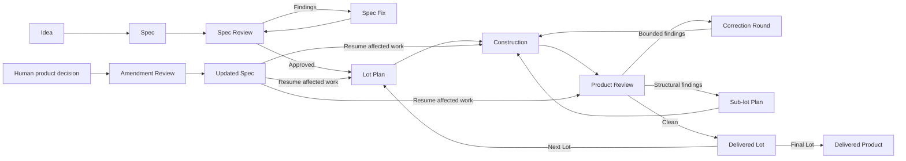

# Build With Review

BWR turns one product request into reviewed, tested, and committed work.

BWR separates creation, independent validation, and correction.

## How BWR works

A new run first validates its Human-approved Gate. The Orchestrator then writes the Spec.

Independent Reviewers challenge the Spec, and a Fixer corrects it until the Spec becomes clean.

The approved Spec divides the product into ordered Lots. Each Lot receives a reviewed Plan.

Each Task passes through Design, self-review, Design checking, implementation, self-review, Code checking, and the complete Gate.

Product Review then examines the built product through independent lenses.

A bounded problem opens a Correction Round. A structural problem opens a Sub-lot with its own Plan.

A clean Product Review delivers the Lot. BWR then starts the next Lot or completes the product.

A new Human product decision follows an Amendment review. It updates the Spec before affected work continues.

## Authority and records

The Human owns product decisions. The Orchestrator owns routing and durable operating memory. Specialists own only their assigned work.

Use Git for tracked history. Preserve unrelated work. Use Reports and Handoffs for specialist results.

## Enter BWR

Resolve the directory containing this file as `<BWR_SKILL>`.

Read once; reread as needed:

- `<BWR_SKILL>/prompts/common/workflow.md`;
- `<BWR_SKILL>/prompts/common/parent.md`;
- `<BWR_SKILL>/prompts/roles/orchestrator.md`.

You are the Orchestrator.

### New run

For a new BWR run, read and execute:

`<BWR_SKILL>/prompts/workflows/startup/initial.md`

The Startup Workflow owns every setup detail and the next route.
